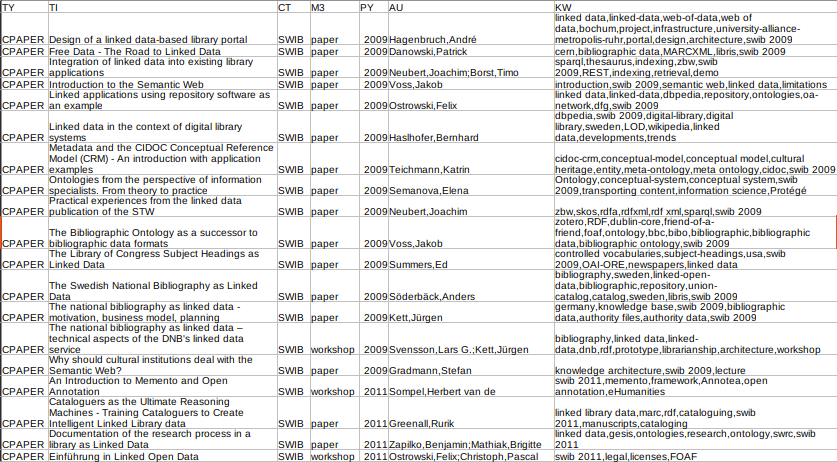
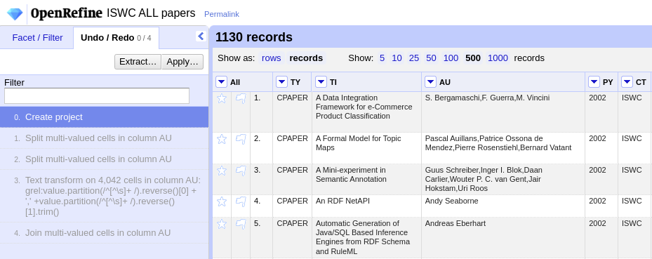
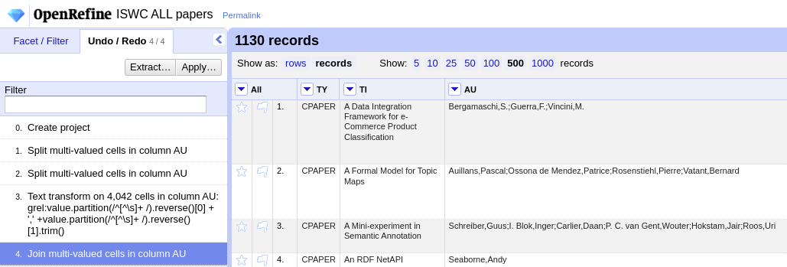
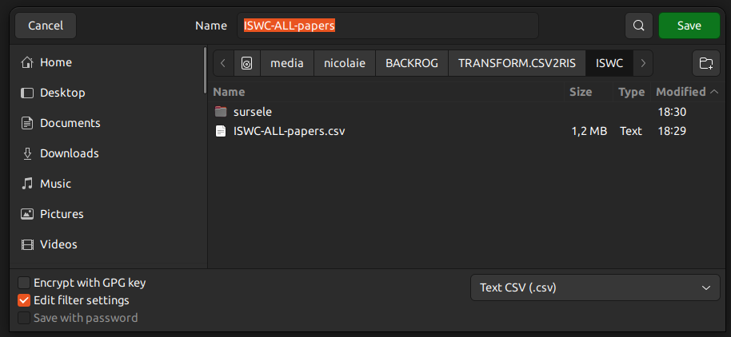
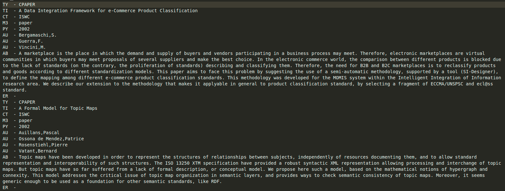

# csv-to-ris

@en_GB This script maps a CSV bibliographic record set to a RIS bibliographic record set. Also contains the project in OpenRefine for data massaging. Follow the Undo/Redo history.
This version of the script also includes the abstract column. Mind the formating Check first against LibreOffice Calc and save with filter editing. Set all fields to be eclosed in `""`.

@ro_RO Acesta este un script Node.js care transformă o structură simplă CSV într-un fișier RIS. Această versiune permite includerea abstractului dacă se dorește.

Fișierul CSV se va pune în subdirectorul `assets`. Din motiv demonstrativ, am lăsat un fișier de lucru care acoperă articolele prezentate la SWIB până în prezent.
Pentru a prelucra propriile date, acest fișier va fi înlocuit cu cel propriu. Sursa datelor poate fi oricare. Pentru propriul uz le-am obținut din Obsidian, le-am reformatat în OpenRefine și le-am introdus în LibreOffice Calc pentru a le salva cu fiecare câmp având datele introduse între ghilimele duble.

Pentru cei interesați de istoricul de transformare a datelor în OpenRefine, am lăsat în rădăcină proiectul care poate fi deschis fără probleme (conține și datele). Am folosit OpenRefine 3.7.1.
Vezi istoricul Undo/Redo și vei vedea pas cu pas cum am aplicat transformările datelor.

CSV-ul trebuie să-l formatezi cu fiecare coloană având în header codul corespunzător din RIS.

O captură de ecran este lămuritoare:



Puncte la care trebuie acordată atenție:

1. Autorii trebuie formatați după următorul șablon: `familie,nume`. Dacă sunt mai mulți, vor fi separați prin punct și virgulă: `familie,nume;familie,nume;familie,nume`.
2. Cuvintele cheie trebuie separate prin virgule fără spații: `cu_cheie1,cuv_cheie2`.
3. Abstractul trebuie să fie recunoscut corect. Verifică mai întâi în LibreOffice Calc.

La punctul 1 pentru a ajunge la formula de formatare `familie,nume;familie,nume;familie,nume` se va proceda la o mică sesiune de transformare a datelor folosind OpenRefine. Cel mai probabil veți avea autorii în formula `nume familie, nume familie` precum în imaginea de mai jos imediat după crearea proiectului în [OpenRefine](https://openrefine.org/).



Formula magică pentru transformarea valorilor autorilor este: `value.partition(/^[^\\s]+ /).reverse()[0] + ',' +value.partition(/^[^\\s]+ /).reverse()[1].trim()`.
Mai jos pun toate etapele de transformare pentru a fi mai simplu celor care vor să recreeze pașii (vezi Undo/Redo -> Apply -> Paste -> Perform opperations).

```json
[
  {
    "op": "core/multivalued-cell-split",
    "columnName": "AU",
    "keyColumnName": "TY",
    "mode": "separator",
    "separator": ";",
    "regex": false,
    "description": "Split multi-valued cells in column AU"
  },
  {
    "op": "core/multivalued-cell-split",
    "columnName": "AU",
    "keyColumnName": "TY",
    "mode": "separator",
    "separator": ",",
    "regex": false,
    "description": "Split multi-valued cells in column AU"
  },
  {
    "op": "core/text-transform",
    "engineConfig": {
      "facets": [],
      "mode": "record-based"
    },
    "columnName": "AU",
    "expression": "grel:value.partition(/^[^\\s]+ /).reverse()[0] + ',' +value.partition(/^[^\\s]+ /).reverse()[1].trim()",
    "onError": "keep-original",
    "repeat": false,
    "repeatCount": 10,
    "description": "Text transform on cells in column AU using expression grel:value.partition(/^[^\\s]+ /).reverse()[0] + ',' +value.partition(/^[^\\s]+ /).reverse()[1].trim()"
  },
  {
    "op": "core/multivalued-cell-join",
    "columnName": "AU",
    "keyColumnName": "TY",
    "separator": ";",
    "description": "Join multi-valued cells in column AU"
  }
]
```

După transformare ar trebui să ajungeți la următorul rezultat.



Se va exporta din OpenRefine ca CSV și se va deschide cu LibreOffice Calc pentru a-l salva din nou ca CSV dar înainte de save te asiguri că toate câmpurile sunt între `"`.



Te asiguri că ai bifat *Quote all text cells* iar la *String delimiter* ai valoarea `"`.

Pune fișierul rezultat sub numele de `a.csv` în subdirectorul `assets`.

Pentru a face conversia, tot ce mai rămâne este să executați scriptul: `node app.js`. La final, vei obține în rădăcina proiectului fișierul cu extensia ris.



Acesta poate fi importat mai departe în aplicații specializate precum Zotero sau EndNote.

## Atenție

Dacă rezultatul așteptat nu este cel dorit, pentru o nouă încercare după ajustarea fișierului CSV sursă, se va șterge fișierul `result.ris` din rădăcină. Aplicația este proiectată să adauge date în fișierul `result.ris` și astfel, vei crede la o primă inspecție că nu s-a întâmplat nimic. De fapt datele vor fi scrise în completare. Din această cauză, cel mai bine, de fiecare dată când faci o transformare, asigură-te că fișierul `result.ris` nu există.

Atenție mare la drepturile asupra datelor. Fiți foarte atent la ce licențe poartă cele originale sau care este regimul de exploatare a acestora de la sursă. Pentru că datele din fișierul de exemplificare pe care l-am lăsat în directorul `assets` au fost recoltate de pe site-ul unei surse private, sunt câteva de exemplu. Nu încălcați drepturile de proprietate intelectuală sub nicio formă și respectați prevederile GDPR.

## Muțumiri

[UToronto Library](https://mdl.library.utoronto.ca/technology/tutorials/openrefine-tutorial-3-regular-expressions-regex-activity) pentru inspirata sugestie de a folosi funcția `partition` în GREL.
## Catalist

(Teza - UnitBV)

## Licence

MIT License
